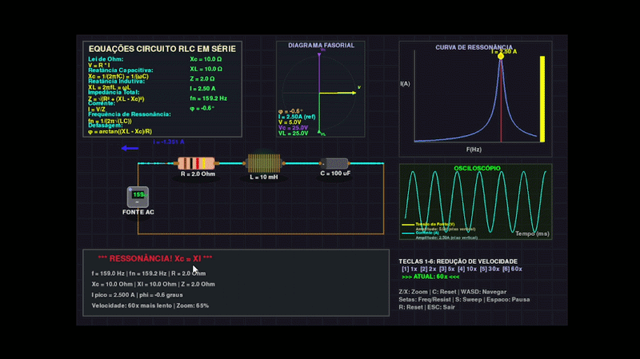

# Simulador Circuito RLC Série / Series RLC Circuit Simulator

**Autora:** Luana M. Souza 
**GitHub:** [m0rang0azul](https://github.com/m0rang0azul)

Simulador interativo de um circuito RLC em série para o ensino do fenômeno de ressonância.

## 🎥 Demonstração



## Funcionalidades

- ⚡ Visualização em tempo real da corrente alternada
- 📊 Osciloscópio integrado
- 📈 Curva de ressonância
- 📐 Diagrama fasorial
- 🎮 Controles interativos

## Controles
- ⬆️⬇️ aumenta/diminui a frequência
- ⬅️➡️ aumenta/diminui a resistência
- Z/X aumentar/diminuir o zoom
- S automático (auto-sweep)
- R resetar
- ESC sair
- 1, 2, 3, 4, 5, 6 reduzir a velocidade

## Referências

-Livro: HALLIDAY, David; RESNICK, Robert; WALKER, Jearl. **Fundamentos de Física - Eletromagnetismo**. 10ª ed. Rio de Janeiro: LTC, 2016.

-Vídeo: Traçando Diagramas Fasoriais de Circuitos RLC Série (https://youtu.be/iXSSWWzVG68?si=P4G4uhAskWeDo68H).

## Como executar

```bash
pip install -r requirements.txt
python circuito_rlc.py
